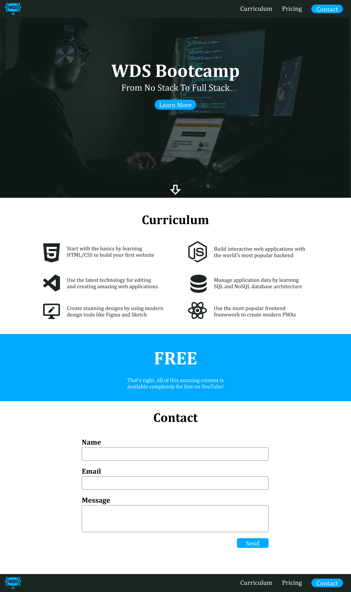

# Web Dev Simplified - Bootcamp Landing Page

## Table of Contents
  - [The Challenge](#the-challenge)
  - [Links](#links)
  - [Built with](#built-with)

### The Challenge

### Links

- Live Site URL: [Bootcamp Landing Page - Netlify](https://wds-bootcamp-landing-page.vercel.app/)

### Built with

- HTML5
- CSS3
